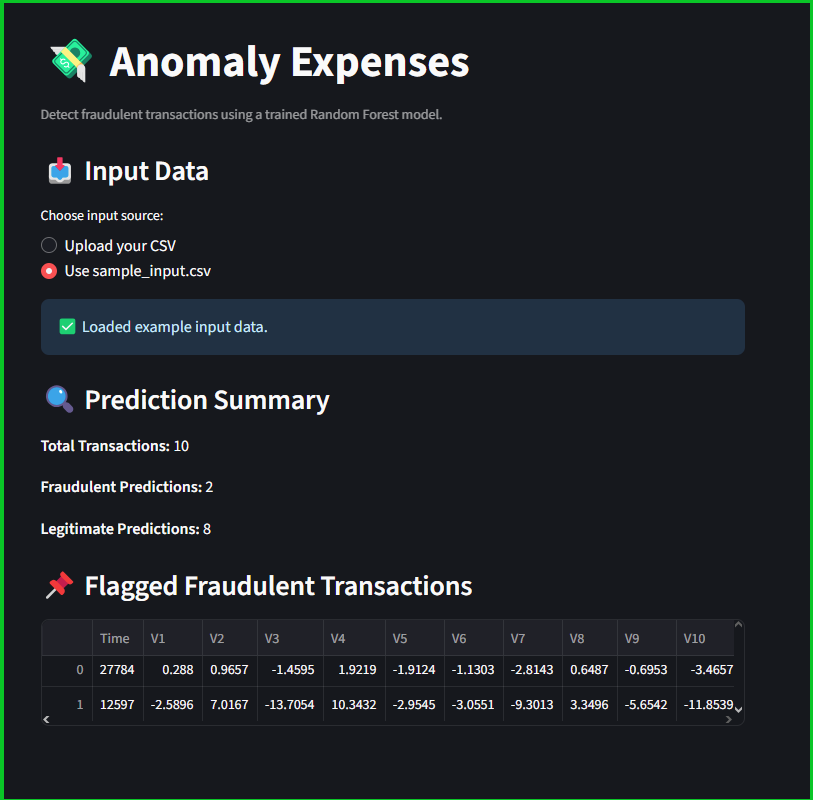

# 💸 Anomaly Expenses

**Anomaly Expenses** is a machine learning project designed to detect unusual or potentially fraudulent expense transactions using real-world credit card data.

This project was built as part of my effort to deepen my understanding of ML workflows. It demonstrates the full pipeline. from raw data to usable fraud detection model, using common industry tools and clean coding practices.

### 🔧 Pipeline Includes:
- Data loading and preprocessing
- Exploratory data analysis (EDA)
- Fraud detection using machine learning (Logistic Regression, Random Forest)
- Model export and deployment
- Streamlit web app for interactive use

---

## 🔍 Dataset

- **Source:** [Kaggle Credit Card Fraud Detection Dataset](https://www.kaggle.com/datasets/mlg-ulb/creditcardfraud)
- Based on anonymized European card transactions from 2013.
- Highly imbalanced: 492 frauds out of 284,807 total transactions (~0.17% fraud rate).
- To run locally, place `creditcard.csv` in the `data/` folder

---

## 📒 Notebooks Overview

| Notebook | Description |
|----------|-------------|
| `01_data_cleaning.ipynb` | Loads and cleans raw data (deduplication, label conversion) |
| `02_exploratory_analysis.ipynb` | Visualizes feature distributions, fraud patterns, and correlations |
| `03_modeling_logistic_regression.ipynb` | Trains logistic regression with class weighting and evaluates performance |
| `04_modeling_random_forest.ipynb` | Trains a Random Forest classifier with better precision-recall balance |
| `05_deployment_notes.ipynb` | Documents how to serve predictions via Streamlit, including folder structure and model loading |

---

## 📊 Model Comparison

| Model               | Precision | Recall | F1 Score | Notes |
|---------------------|-----------|--------|----------|-------|
| **Logistic Regression** | 0.06      | **0.87**   | 0.11     | High recall, too many false positives |
| **Random Forest**        | **0.97**  | 0.71   | **0.82** | Balanced, reliable — suitable for deployment ✅ |


---

## 🚀 Live Demo

Try the model interactively using the [public Streamlit app](https://anomaly-expenses.streamlit.app).

[](https://stats.uptimerobot.com/xiEXTeAZLk)




---

## ▶️ Run locally

```bash
# 1. Install dependencies
pip install -r requirements.txt
# 2. Launch the app
streamlit run streamlit_app.py
```
---
### 📤 Upload format
- The app supports any CSV file with the following columns:
Time, V1, V2, ..., V28, Amount
- The column is_fraud (if present) will be ignored.
- A sample input file is provided at data/sample_input.csv

### 📈 App Output
- Fraud prediction summary
- Downloadable table of detected frauds
- Error handling for invalid file formats

⚠️ Disclaimer: This model is trained on anonymized PCA features for educational purposes. It is **not production-ready** without further validation, retraining, and monitoring.

---

## 🧱 Tech Stack

- Python 3.10+
- pandas – Data manipulation and cleaning
- numpy – Numerical operations
- scikit-learn – Machine learning models and utilities
- joblib – Model serialization
- matplotlib & seaborn – Visualizations and plots
- streamlit – Interactive frontend for predictions
- jupyter – Notebook-based workflow and documentation

---

## 🗂️ Project Structure
```
anomaly-expenses/
│
├── data/                  # Raw and cleaned CSVs
├── models/                # Saved trained model (.pkl)
├── notebooks/             # Jupyter notebooks (EDA, modeling, deployment)
├── assets/                # Images, demo screenshots, etc.
├── streamlit_app.py       # Streamlit web app
├── save_clean_model.py    # Script to train & export model
├── requirements.txt       # Python dependencies
└── README.md
```
---

## 📄 License
```
This project is released under the [MIT License](LICENSE).
© For educational and demonstration purposes only.
```